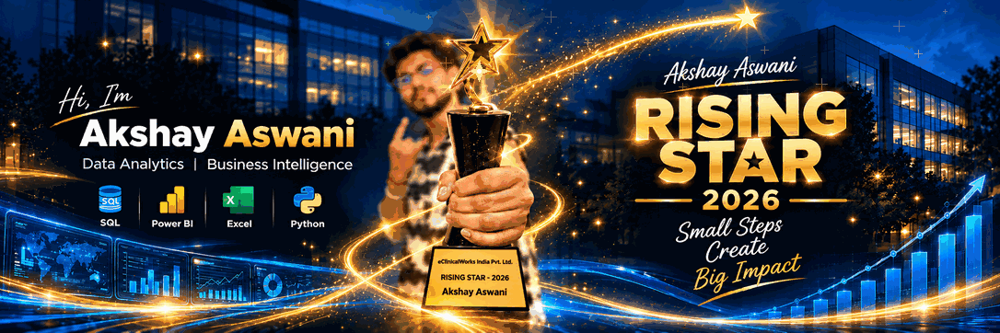

# 👋 Hey there, I'm Akshay Aswani

### NOC Engineer | Data Analytics & Business Intelligence

---

## 🪄 About Me

- 💼 **NOC Engineer at eClinicalWorks**, working with infrastructure monitoring, incident response, SLA tracking, and operational reporting.
- 🧭 Professional background spanning **Network Operations, Site Reliability Engineering, and Data Engineering**.
- 📊 I build analytics projects that connect **business questions, SQL analysis, data modeling, KPIs, and dashboards**.
- 🛠️ Hands-on with **SQL Server, MySQL, Power BI, Excel, Python, Git, and GitHub**.
- 🏆 **Rising Star Award — 2026**, eClinicalWorks India Pvt. Ltd.
- 📍 Based in India.

> **Small Steps Create Big Impact.**

---

## 🧠 Languages & Tools

| Focus area | Skills and tools |
|---|---|
| **Analytics & BI** | Power BI, DAX, Power Query, Excel, PivotTables, KPI dashboards |
| **Databases** | SQL, SQL Server, MySQL, joins, CTEs, window functions, views |
| **Programming** | Python, pandas, NumPy |
| **Data modeling** | Relational modeling, star schema, data validation |
| **Business domains** | IT operations, incident/SLA analytics, finance, transportation, retail, education |
| **Development tools** | Git, GitHub, VS Code |

---

## 🚀 Featured Analytics Projects

| Project | Stack | What it demonstrates |
|---|---|---|
| [**🖥️ Akitya IT Services — NOC Incident, SLA & Operations Analytics**](https://github.com/aaswani365/Akitya-IT-Services-NOC-Analytics) | MySQL · Power BI | **Completed** · 60K incident records, star schema, SLA and root-cause analysis · [Live Power BI Dashboard](https://app.powerbi.com/view?r=eyJrIjoiZDllZGQ2ZDItODI3NS00MWIyLWI4MzMtYzE2NjRiMzJkOTZjIiwidCI6IjM0YmQ4YmVkLTJhYzEtNDFhZS05ZjA4LTRlMGEzZjExNzA2YyJ9) |
| [**💰 Loan Portfolio & Financial Decision Engine**](https://github.com/aaswani365/Loan-Portfolio-Financial-Decision-Engine) | Excel | 10K simulated loans, risk assessment, amortization, forecasting and decision support |
| [**🏦 Bank Loan Analytics Dashboard**](https://github.com/aaswani365/bank-loan-analytics-dashboard) | SQL · Power BI | Loan KPIs, funding and repayments, borrower segmentation, portfolio trends |
| [**🚖 TOLA Cabs — Jaipur Analytics**](https://github.com/aaswani365/tola-cabs-jaipur-analytics) | MySQL · Power BI | 150K booking records, cancellations, revenue, ratings and ride trends |
| [**🎓 Student Performance, Learning & Engagement Analytics**](https://github.com/aaswani365/Student-Performance-Learning-Engagement-Analytics) | Excel | 10K students, engagement, attendance, grades, performance and support-priority insights |

### 🚧 Currently Building

**Retail Sales & Inventory Intelligence** — SQL Server · Power BI  
An enterprise-style retail analytics solution with sales, inventory, customers, returns, data quality checks, analytics views, and an executive KPI model.

---

## 🔄 My Analytics Workflow

`Business Problem` → `Data Preparation` → `SQL / Excel Analysis` → `Data Modeling` → `KPIs` → `Dashboards` → `Insights`

---

## 🏆 Achievements & Learning

- ⭐ **Rising Star 2026 — eClinicalWorks India Pvt. Ltd.**
- 📚 Continuing hands-on learning in SQL, Power BI, Excel, Python, and analytics engineering.
- 🔗 Professional learning profiles: [Credly](https://www.credly.com/users/akshay-aswani.5ff8f319) · [Google Cloud Skills Boost](https://www.cloudskillsboost.google/public_profiles/db99eb93-fc0b-46d7-bd30-4ad1c229aa8b) · [Salesforce Trailblazer](https://trailblazer.me/id/akki2089)

---

## 📊 GitHub Stats

### 🐍 Contribution Snake

⚙️ How to enable the contribution snake

Add the workflow file supplied alongside this README at `.github/workflows/snake.yml`, commit it, then run **Actions → Generate contribution snake → Run workflow**. GitHub Actions must be enabled for the profile repository. The workflow publishes the SVG to the `output` branch.

---

## 🌐 Connect With Me

**⭐ Thanks for visiting my profile!**

*Turning operational experience and raw data into meaningful business insights.*

